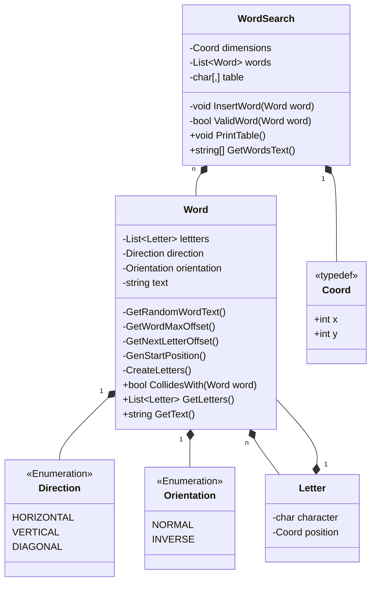
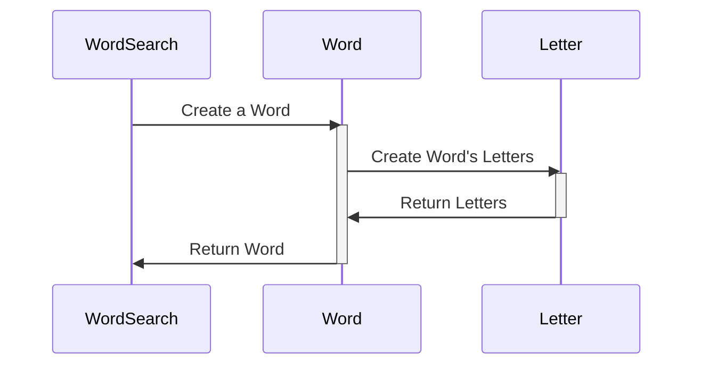

# WordSearch

Aplicativo de console que gera caça-palavras de dimensões e quantidades de palavras arbitrárias. As palavras pode ser horizontais, verticais ou diagonais, em ordem direta ou inversa. Para gerar caça-palavras diferentes, usa posicionamento e escolha de palavras aleatórias.

## Conceitos aplicados:

* **Classes**: para implementar a representação de letras, palavras, e do próprio caça-palavras;
* **Enumerações**: para enumerar as orientação e direções possíveis para uma palavra;
* **Estruturas de dados**: arrays para representar a tabela de caracteres, e listas para o acoplamento de composição entre as classes;
* **Encapsulamento**: para isolar o comportamento e estado internos e externos;
* **Tratamento de Exceções**: para lidar com a exceção em tempo de execução, para quando a criação do caça-palavras falha por uma densidade de palavras muito alta, e se comunicar com o usuário sobre;
* **Testagem**: para escrever testes que validam o funcionamento adequado da geração;
* **Tipagem estática** e **estruturas de controle** ao longo de todo o programa;
* **Código limpo**: nomeação cuidadosa de variáveis, métodos, e uso de espaçamento bem pensado para tornar o código limpo, legível e compreensível;
* **Leitura de arquivos**: para ler os dados que formam o vocabulário do caça-palavras.

## Exemplos

## Diagrama de Classes

A estrutura, estado e comportamento das classes aplicadas na resolução de problemas, junto dos respectivos acoplamentos se encontra no diagrama de classes abaixo:

## Diagrama de Atividade

O gráfico da relação entre os objetos pode ser visto no diagrama de atividades abaixo:

