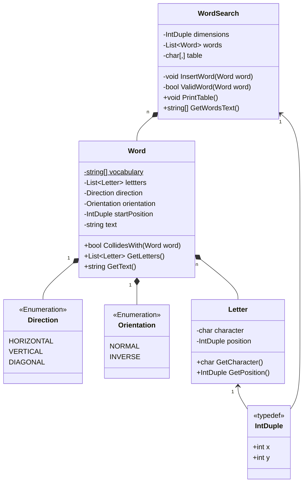
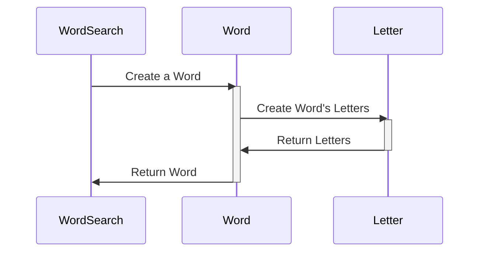

```mermaid

classDiagram

Word "1" *-- Direction
Word "1" *-- Orientation
Word "n "*-- Letter

WordSearch "n" *-- Word
WordSearch "1" <-- IntDuple

Letter "1" <-- IntDuple

class IntDuple {
	<<typedef>>
	+int x
	+int y
}

class Orientation {

	<<Enumeration>>
	NORMAL
	INVERSE
}

  

class Direction {

	<<Enumeration>>
	HORIZONTAL
	VERTICAL
	DIAGONAL
}

class Letter {

	-char character
	-IntDuple position
	
	+char GetCharacter()
	+IntDuple GetPosition()
}

class Word{

	-string[] vocabulary$
	-List~Letter~ lettters
	-Direction direction
	-Orientation orientation
	-IntDuple startPosition
	-string text
	
	+bool CollidesWith(Word word)
	+List~Letter~ GetLetters()
	+string GetText()
}

class WordSearch {

	-IntDuple dimensions
	-List~Word~ words
	-char[,] table
	
	-void InsertWord(Word word)
	-bool ValidWord(Word word)
	
	+void PrintTable()
	+string[] GetWordsText()
}

```

```mermaid
sequenceDiagram

participant WordSearch
participant Word
participant Letter

WordSearch ->> Word: Create a Word
activate Word
	
	Word ->> Letter: Create Word's Letters
	
	activate Letter
		Letter ->> Word: Return Letters
	deactivate Letter
	
	Word ->> WordSearch: Return Word

deactivate Word
```