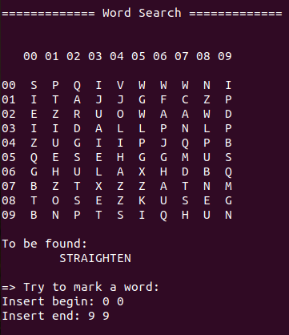
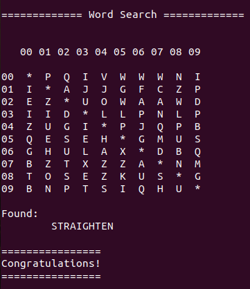
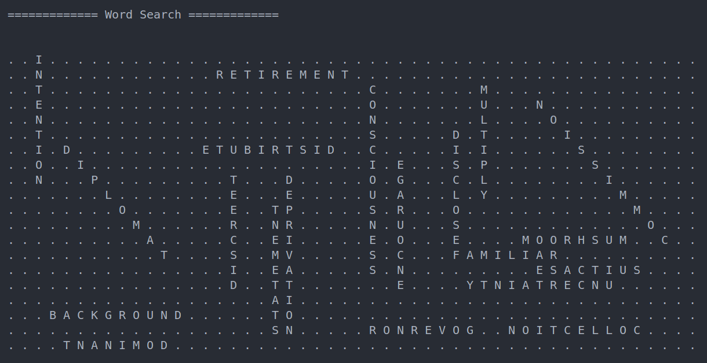
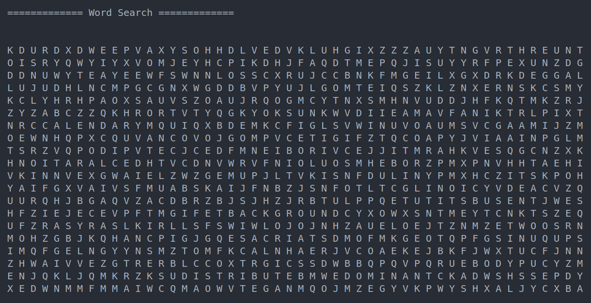

# WordSearch

Aplicativo de console em C# que gera caça-palavras de dimensões e quantidades de palavras arbitrárias, usando orientação a objetos e permite jogar a partir de entradas no teclado. As palavras podem ser horizontais, verticais ou diagonais, em ordem direta ou inversa. Diversos conceito de programação são aplicados aqui, de acordo com a descrição do projeto, junto de diagramas que ilustram a estrutura do programa.

**Atualização**: Código foi refatorado para aumentar a abstração, tornando-o mais legível e estruturado.

Agora permite que o usuário ache e marque uma palavra no caça-palavrs (se ela for válida), inserindo a posição inicial e final. Se bem sucedido, a palavra passa a ficar marcada no caça-palavras, e a palavra passa a ficar listada como encontrada. Ao achar todas as palavras, a vitória é anunciada e o jogo encerrado, como pode ser visto numa simples demonstração abaixo.

| Marcando palavra   | Palavra marcada e vitória |
| ------------------ | ----------------- |
|   |  |

## Conceitos aplicados

* **Classes**: para implementar a representação de letras, palavras, e do próprio caça-palavras;
* **Enumerações**: para enumerar as orientação e direções possíveis para uma palavra;
* **Estruturas de dados**: arrays para representar a tabela de caracteres, e listas para o acoplamento de composição entre as classes;
* **Encapsulamento**: para isolar o comportamento e estado internos e externos;
* **Tratamento de Exceções**: para lidar com a exceção em tempo de execução, para quando a criação do caça-palavras falha por uma densidade de palavras muito alta, e se comunicar com o usuário sobre;
* **Testagem**: para escrever testes que validam o funcionamento adequado da geração;
* **Tipagem estática** e **estruturas de controle** ao longo de todo o programa;
* **Código limpo**: nomeação cuidadosa de variáveis, métodos, e uso de espaçamento bem pensado para tornar o código limpo, legível e compreensível;
* **Leitura de arquivos**: para ler os dados que formam o vocabulário do caça-palavras.

## Exemplos

Abaixo seguem exemplos do resultado, demonstração e exemplo real. Nas imagens as palavras a serem procuradas foram omitidas para melhorar a exibição.

| Demonstração       | Exemplo real      |
| ------------------ | ----------------- |
|   |  |

## Diagrama de Classes

A estrutura, estado e comportamento das classes aplicadas na resolução de problemas, junto dos respectivos acoplamentos se encontra no diagrama de classes abaixo:

## Diagrama de Atividade

O gráfico da relação entre os objetos pode ser visto no diagrama de atividades abaixo:

